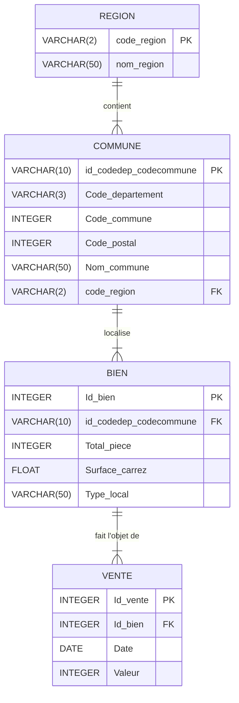

```mermaid
erDiagram
    REGION ||--|{ COMMUNE : "contient"
    COMMUNE ||--|{ BIEN : "localise"
    BIEN ||--|{ VENTE : "fait l'objet de"

    REGION {
        VARCHAR(2) code_region PK
        VARCHAR(50) nom_region
    }

    COMMUNE {
        VARCHAR(10) id_codedep_codecommune PK
        VARCHAR(3) Code_departement
        INTEGER Code_commune
        INTEGER Code_postal
        VARCHAR(50) Nom_commune
        VARCHAR(2) code_region FK
    }

    BIEN {
        INTEGER Id_bien PK
        VARCHAR(10) id_codedep_codecommune FK
        INTEGER Total_piece
        FLOAT Surface_carrez
        VARCHAR(50) Type_local
    }

    VENTE {
        INTEGER Id_vente PK
        INTEGER Id_bien FK
        DATE Date
        INTEGER Valeur
    }
```
